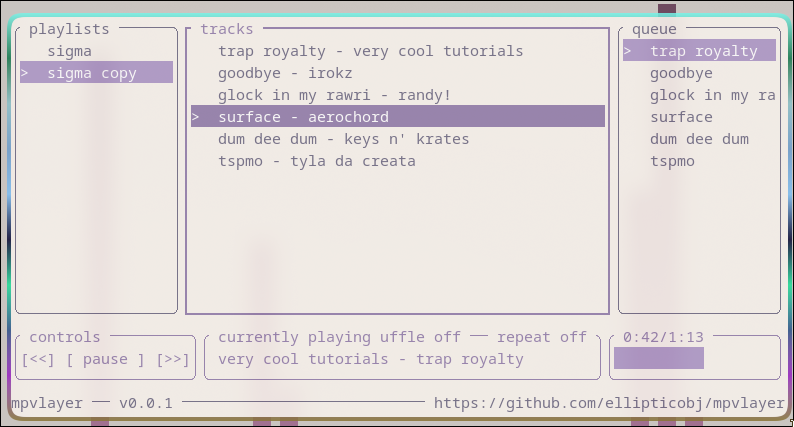

# mpvlayer

this is a **work in progress**

a tui wrapper for mpv

## requirements
### stuff you probably have to install
yt-dlp
mpv

### stuff you probably dont have to install
kill
pidof

## screenshots

## progress
- [x] ui
- [x] playing
- [ ] pausing
- [ ] repeat
- [ ] shuffle
- [ ] edit library