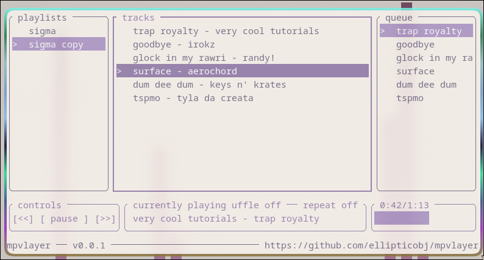

# mpvlayer

this is a **work in progress**

a tui wrapper for mpv

# buglist
- [ ] error on skipping to next track when queue is empty
- [ ] error when first queue ended and new queue is played

## requirements
### stuff you probably have to install
cargo
yt-dlp
mpv

### stuff you probably dont have to install
kill
pidof

## installing
#### install yt-dlp:
```
curl -L https://github.com/yt-dlp/yt-dlp/releases/latest/download/yt-dlp -o ~/.local/bin/yt-dlp
chmod a+rx ~/.local/bin/yt-dlp
```
or
```
python3 -m pip3 install --user yt-dlp
```
or with your favorite package manager

(https://github.com/yt-dlp/yt-dlp/wiki/Installation)

#### install mpv:
use your favorite package manager
or
https://mpv.io/installation/

#### install rust
```
curl --proto '=https' --tlsv1.2 -sSf https://sh.rustup.rs | sh
```

#### install this:
```
git clone https://github.com/ellipticobj/mpvlayer.git
cd mpvlayer
cargo build --release
mv target/release/mpvlayer /usr/local/bin/mpvlayer
```

## screenshots

